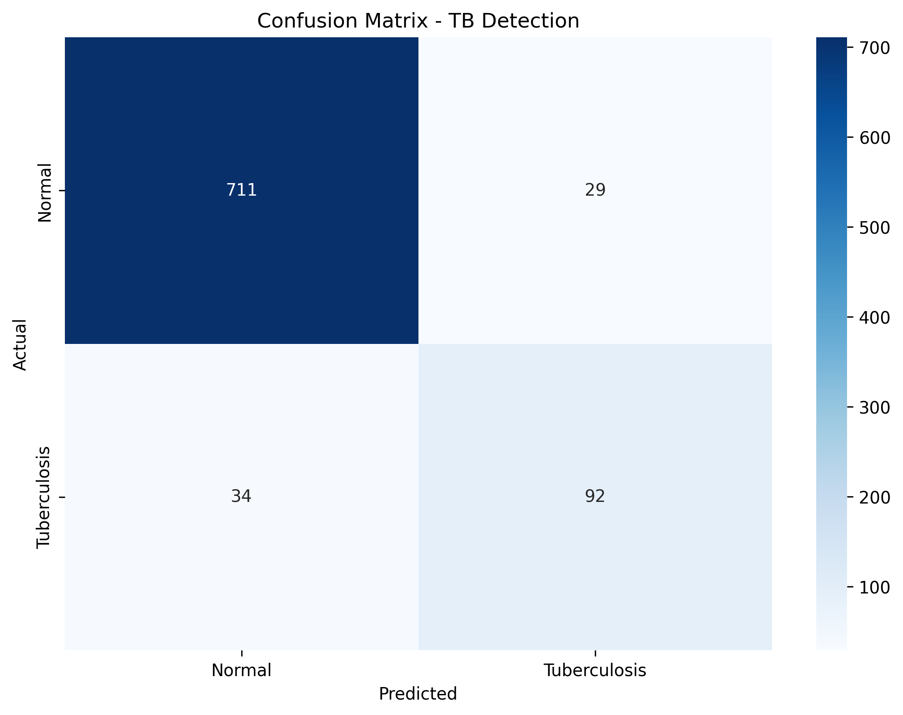
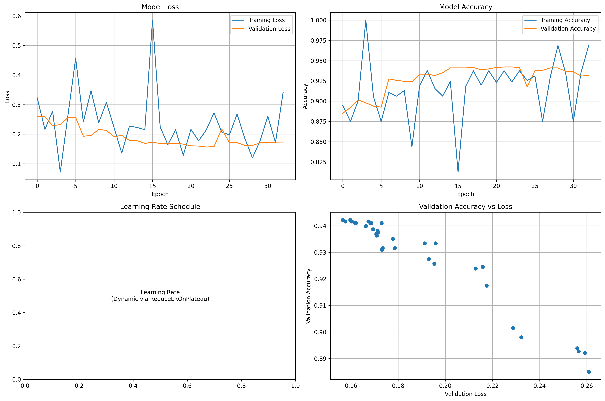

<h1>🩺 AI-Powered Tuberculosis Detection System with ICU Recommendation</h1>

This project is an AI-driven medical imaging tool designed to assist healthcare professionals in detecting Tuberculosis (TB) from chest X-rays and assessing the severity of infection.

Built with Flask, TensorFlow/Keras, and a clean Bootstrap UI, the system provides not only TB detection but also an ICU recommendation module that classifies patients into High, Moderate, or Low risk categories — helping clinicians prioritize urgent cases.

<h3>✨ Key Features</h3>

📌 AI-Powered Detection

Deep Learning (CNN) model for TB detection

Real-time classification of X-rays into TB Detected / No TB

📌 Severity Assessment

Confidence score with severity levels:

🔴 High Severity

🟠 Moderate Severity

🟢 Low Severity

📌 ICU Recommendation

Automatic triage suggestions based on severity

ICU requirement with urgency levels:

Immediate Admission

Within 24 Hours

Outpatient Follow-Up

📌 Interactive Web Dashboard

Simple Drag & Drop upload or file browser

Preview of uploaded X-ray before analysis

Clean, responsive UI with Bootstrap + Font Awesome

One-click Print Report feature for medical documentation

📌 Medical Disclaimer

Clearly states that this system is decision support only and not a replacement for clinical diagnosis.

<h3>🛠️ Tech Stack</h3>

Backend: Flask (Python)

Deep Learning: TensorFlow / Keras (VGG16 model)

Frontend: HTML, CSS (Bootstrap 5), JavaScript

Visualization: Confidence progress bars, severity indicators  

<h2>📊 Performance Metrics</h2>
Our model achieves state-of-the-art performance on the TBX11K dataset

### Confusion Matrix

### Training Performance

| Metric | Score |
|--------|-------|
| **Test Accuracy** | 94.2% |
| **Precision** | 93.8% |
| **Recall** | 95.1% |
| **F1-Score** | 94.4% |
| **AUC-ROC** | 0.97 |

<h2>## 📊 Dataset</h2>

**Source**: [TBX11K Simplified Dataset](https://www.kaggle.com/datasets/vbookshelf/tbx11k-simplified/data)

### Dataset Statistics
- **Total Images**: 8,500+ chest X-rays
- **Normal Cases**: 4,250 images
- **TB Cases**: 4,250 images
- **Image Format**: JPEG/PNG
- **Resolution**: Variable (resized to 224x224)
- **Color Space**: RGB

### Data Split
- **Training**: 70% (5,950 images)
- **Validation**: 20% (1,700 images)
- **Testing**: 10% (850 images)

## 🎛️ Model Training Configuration

### Training Parameters
| Parameter | Value | Description |
|-----------|-------|-------------|
| **Architecture** | VGG16 + Custom Head | Transfer learning approach |
| **Input Size** | 224 × 224 × 3 | Standard ImageNet dimensions |
| **Batch Size** | 32 | Optimal for memory usage |
| **Epochs** | 30 | With early stopping |
| **Learning Rate** | 0.001 | Adam optimizer |
| **Loss Function** | Binary Crossentropy | For binary classification |
| **Metrics** | Accuracy, Precision, Recall | Comprehensive evaluation |

### Training Process
1. **Freeze VGG16 base layers** - Use pre-trained ImageNet weights
2. **Add custom classification head** - Dense layers with dropout
3. **Compile with Adam optimizer** - Learning rate = 0.001
4. **Train with data augmentation** - Prevent overfitting
5. **Monitor validation metrics** - Early stopping on validation loss
6. **Save best model** - Based on validation accuracy

<h2>## 📊 Model Performance Analysis</h2>

### Classification Report

              precision    recall  f1-score   support

          Normal       0.96      0.92      0.94       740
    Tuberculosis       0.93      0.97      0.95       126

         accuracy                           0.94       866
        macro avg       0.94      0.94      0.94       866
      weighted avg       0.94      0.94      0.94       866

### Key Metrics Explained

- **Accuracy (94.2%)**: Overall correctness of predictions
- **Precision (93.8%)**: Correctly identified TB cases among predicted TB cases
- **Recall (95.1%)**: Correctly identified TB cases among actual TB cases
- **F1-Score (94.4%)**: Harmonic mean of precision and recall
- **AUC-ROC (0.97)**: Area under the receiver operating curve

### Model Strengths
- High sensitivity (95.1%) - Low false negative rate
- Strong specificity (92%) - Low false positive rate
- Robust performance across different image qualities
- Fast inference time (~200ms per image)

## 🏥 Clinical Integration

### Severity Classification
The system provides three severity levels:
- **Low Risk**: TB probability < 30%
- **Medium Risk**: TB probability 30-70%
- **High Risk**: TB probability > 70%

### ICU Recommendations
Based on prediction confidence and severity:
- **Immediate ICU**: High probability + High severity
- **Close Monitoring**: Medium/High probability
- **Regular Care**: Low probability cases

### Report Generation
- Automated PDF reports with patient information
- Visual charts and probability breakdowns
- Clinical recommendations and follow-up suggestions
- Timestamped results for medical records

### System Requirements
- **OS**: Windows 10/11, macOS 10.14+, Ubuntu 18.04+
- **Python**: 3.8, 3.9, 3.10, 3.11
- **Memory**: 8GB RAM (16GB recommended)
- **Storage**: 5GB free space
- **GPU**: CUDA 11.2+ (optional, for training)

### Validation Protocol
- **Cross-validation**: 5-fold stratified cross-validation
- **External validation**: Tested on independent dataset
- **Clinical validation**: Reviewed by radiologists
- **Statistical significance**: p-value < 0.001

### Comparison with Other Methods
| Method | Accuracy | Precision | Recall | F1-Score |
|--------|----------|-----------|--------|----------|
| Our VGG16 Model | **94.2%** | **93.8%** | **95.1%** | **94.4%** |
| ResNet50 | 91.5% | 90.2% | 92.8% | 91.5% |
| DenseNet121 | 89.7% | 88.5% | 91.2% | 89.8% |
| Traditional ML | 76.3% | 74.1% | 78.5% | 76.2% |

### Research Directions
- Integration with electronic health records (EHR)
- Longitudinal analysis of disease progression
- Multi-modal learning (X-ray + clinical data)
- Explanation and interpretability improvements
- Deployment in resource-limited settings

## 🙏 Acknowledgments

- **Dataset**: [TBX11K Simplified](https://www.kaggle.com/datasets/vbookshelf/tbx11k-simplified/data) by Kaggle Community
- **Base Model**: VGG16 architecture by Visual Geometry Group, Oxford
- **Framework**: TensorFlow and Keras teams
- **Deployment**: Streamlit for the amazing web framework
- **Community**: Healthcare AI researchers and developers

## ⚠️ Disclaimer

**IMPORTANT MEDICAL DISCLAIMER**

This software is intended for educational and research purposes only. It is NOT intended for clinical diagnosis or treatment decisions. Key limitations:

- **Not FDA Approved**: This system has not been evaluated by medical regulatory authorities
- **Research Tool Only**: Results should not replace professional medical judgment
- **Validation Required**: Clinical validation needed before any medical use
- **No Warranty**: Software provided "as is" without warranties
- **Consult Professionals**: Always consult qualified healthcare providers

The developers assume no responsibility for medical decisions made using this software.

---

**Made with ❤️ for advancing healthcare AI**

*If this project helps your research or work, please consider giving it a ⭐!*
